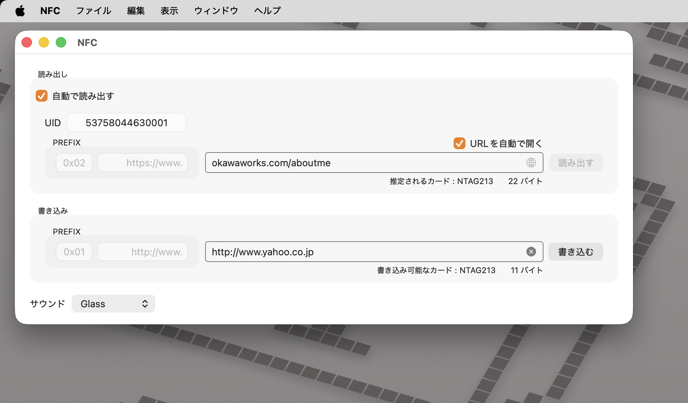
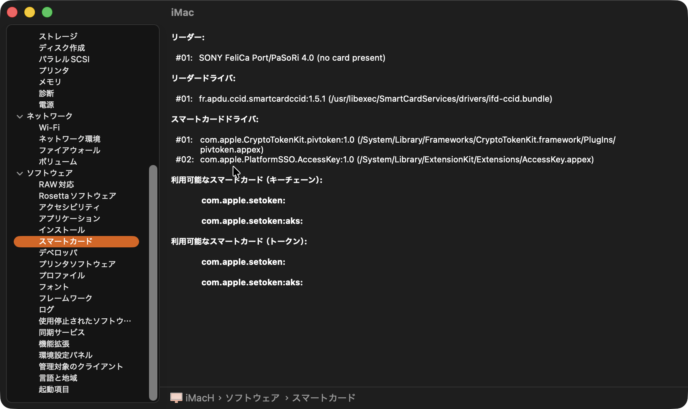

# NFC
## 概要
SONYのカードリーダー「RC-S300」を使って「NTAG213/215」を読み書きするためのアプリケーションの「Xcodeプロジェクト一式」です。

macOS 13以降はSONYの [ドライバ](https://www.sony.co.jp/Products/felica/consumer/support/download/usbdriver.html) インストール不要で利用できます。

すでにカードのリード・ライトができるアプリケーションのプロジェクトです。  
独自のアプリを作りたい場合は、プロジェクト内のLNTAG215クラスを使えば容易に実現可能です。

## ビルドしたアプリケーションの解説

<p align="center">

</p>

シンプルに
- 読み出し
- 書き込み

ができるアプリケーションです。
### 読み出し
#### 「自動で読み出す」チェック
「自動で読み出す」にチェックを入れると、カードを検出した時に自動で読み込み、UIDと読み込んだデータが表示されます。
#### 「読み出す」ボタン
「自動で読み出す」にチェックが入っていない時に有効になります。  
ボタンをクリックした時にカードを読み込みます。
#### 「URLを自動で開く」チェック
「URLを自動で開く」にチェックを入れると、読み込んだデータがWebサイトのアドレスの時に自動でSafariなどで表示します。
#### 地球儀のアイコン
「URLを自動で開く」にチェックが入っていない時に有効になります。 
ボタンをクリックした時、データがWebサイトのアドレスのときにSafariなどで表示します。

### 読み出し
#### 「書き込む」ボタン
テキストフィールドに入力した内容をカードに書き込みます。

#### 削除[X]のアイコン
テキストフィールドの内容を削除します。

### サウンド
読み込み、書き込み完了時に再生するサウンドを選択します。

## アプリ開発に必要な作業
SONYのRC-S300は、macOS上では「スマートカードリーダー」と認識されています。
<p align="center">

</p>


このハードウェアには何も宣言せずにアクセスすることはできず、entitlements.plistを追加しなくてはいけません。  
このプロジェクトにはすでに追加されていますし、ファイル参照の設定もされています。

### entitlements.plistファイルの内容
下表の値を記述したplistを追加します。
| Key | Type | Value |
| --- | ---- | ----- |
| com.apple.security.smartcard | Boolean | YES |

### entitlements.plistファイルの参照登録
XcodeのBuild Settingにentitlements.plistを指定します。  
下記の場所にentitlements.plistのパスを追記します。  
デフォルトでは空っぽです。

<u>**Build Setting > Signing > Setting > Code Signing Entitlements**</u>

追加するのはentitlements.plistのパスです。  
このプロジェクトの場合は、下記の通りになります。

<u>**NFC/entitlements.plist**</u>

## LNTAG215クラス
このクラスにはLNTAG213/215タグをリード・ライトするための機能が全て備わっています。  
このクラスをXcodeプロジェクトに取り込むことで、独自のアプリの開発も可能です。

このクラス自体は完全に独立したクラスにはなっておらず、一部

- LLocalizer.swift
- extensions for NFC.swift

の機能も利用しています。  
必要に応じて、これらのファイルもXcodeに取り込むか、LNTAG215.swiftの中に追記してください。  
また、これらのクラスを使わないように改造しても構いません。

### インスタンスの生成
init()メソッドが用意されています。  
インスタンスを生成するだけで、すべての機能を使うことができます。
```:swift
var card = LNTAG215()
```

### デリゲートの設定
データはデリゲートメソッドによって渡されます。  
例えば、Xcodeプロジェクトを作成したときに作られるViewControllerに**LNTAG215Delegate**を適用してください。
```:swift
extension ViewController: LNTAG215Delegate {

}
```

LNTAG215インスタンスのdelegateにViewControllerのインスタンスをセットします。
```:swift
card.delegate = self
```


このデリゲートを適用すると、下記のメソッドを追加するよう、Xcodeが通知しますので、そのまま作成してください。
```:swift
func didFinishSearchingCardReaders(info: [SmartCardReaderInfo])
func didFinishReadingUID(UID: String?)
func didFinishReadingCardData(cardData: NTAGCardData?)
func didFinishWritingCardData(success: Bool)
```
それぞれの処理が終わったとき、上記メソッドが呼ばれます。
### カードリーダー状態を取得
```:swift
public func searchReaders() 
```
カードリーダーを探します。  
結果は下記デリゲートメソッドで取得できます。
```:swift
func didFinishSearchingCardReaders(info: [SmartCardReaderInfo])
```
カードリーダーが複数接続されている場合を考慮し、infoは配列にしてあります。  
構造体SmartCardReaderInfoはカードリーダーの情報が入っています。  
読み出して適宜処理をしてください。


### UIDのリード
```:swift
public func readUIDAsync()
```
リードを開始します。  
リード結果は下記デリゲートメソッドで取得できます。
```:swift
func didFinishReadingUID(UID: String?)
```
